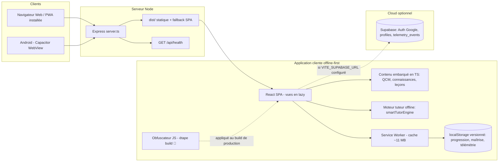
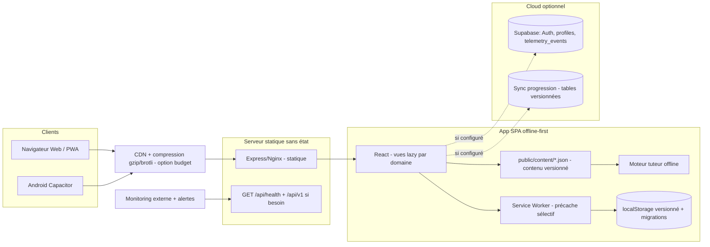
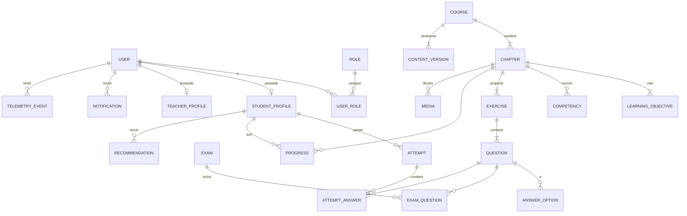

# Audit d'architecture — Kunz El Ouloum (كنز العلوم)

**Application audité :** Kunz El Ouloum — plateforme de révision SVT pour le baccalauréat algérien
**Dépôt :** `sinamind414/kunz-el-ouloum` — branche `arena/01a01a54-kunz-el-ouloum`, commit `1153f28` (`Add files via upload`, 2026-08-15)
**Date de l'audit :** 2026-08-19
**Méthode :** audit statique du code + **mesures exécutées** (build de production, build contrôlé sans obfuscateur, serveur de production réel, tests unitaires locaux, `npm audit`, historique CI GitHub). Tous les constats sont sourcés ; rien n'est supposé.

> Convention du rapport : **[Fait]** = observé et mesuré · **[Hypothèse]** = supposition identifiée comme telle · **[Recommandation]** = action proposée · *Information non disponible* = donnée absente du dépôt.

---

## 1. Résumé exécutif

1. **L'application est un monolithe SPA offline-first** : React 19 + Vite 6 + TypeScript (frontend), Express minimal (serveur statique + `/api/health`), contenu pédagogique embarqué dans le code TypeScript, aucun backend métier. Architecture **simple et adaptée** à une équipe réduite et à un budget modeste.
2. **La promesse « 100 % offline » est tenue au niveau du code** : aucun `fetch` métier dans `src/`, tuteur local par recherche par mots-clés (pas de LLM), Supabase (auth Google + télémétrie) réellement optionnel et chargé à la demande.
3. **Force majeure : la discipline des couches.** 0 import de composants React depuis `data/`, `services/`, `utils/`, `lib/` (vérifié) ; 64 fichiers de tests, 643 tests ; stockage local versionné avec migrations ; export/import de progression ; consentement (TermsModal) ; en-têtes de sécurité présents.
4. **Défaut critique ARCH-001 : le build de production est cassé par l'obfuscateur JavaScript.** Mesuré : 3 chunks JS produits au lieu de 59 (le même build sans le plugin produit 59 chunks), les imports dynamiques deviennent des concaténations calculées à l'exécution, aucun chunk de vue n'est émis, et le serveur répond `200 text/html` (fallback SPA) aux URLs de chunks demandés par le navigateur. Résultat : **toutes les vues chargées en `React.lazy` (leçons, quiz, entraînement, progression, coach, méthodologie…) échouent en production** (« Failed to load module script »). L'obfuscation d'un client web est par ailleurs une protection illusoire.
5. **La CI est rouge sur `master` depuis au moins 4 jours** (10+ runs en échec, y compris le push du commit audité) : 7 tests unitaires échouent (`MyPathView.focusCompass.test.tsx` notamment), ce qui **masque** le défaut ARCH-001 (les étapes Build et E2E sont sautées). Le défaut de build ne peut donc pas être détecté par la chaîne actuelle.
6. **Sécurité : fondations correctes** (CSP, RLS Supabase, pas de secrets dans le dépôt, clé anon uniquement) mais `script-src 'unsafe-inline'` neutralise la principale défense XSS, `X-Powered-By` est exposé, et l'insert de télémétrie reste ouvert en anonyme (limité par whitelist + CHECK).
7. **Données : défaut fonctionnel ARCH-007.** La whitelist RLS de `telemetry_events` (8 événements) ne correspond pas aux 9 événements du code (`COACH_DIAGNOSTIC_CLICKED` émis mais interdit) → un insert multi-lignes contenant cet événement fait échouer tout le flush → la file (plafonnée à 100) se bloque → **télémétrie silencieusement perdue**.
8. **Performance : insuffisante pour la cible.** Aucune compression HTTP (mesuré : 277 kB bruts servis sans `Content-Encoding`), mascotte `mascot.png` de 1,9 MB (1024×1024) utilisée comme icône PWA, et le service worker précache ~11 MB (120 schémas + 22 leçons + mascotte) dès la première visite.
9. **Pédagogie : atout réel mais à valider.** 11 unités alignées sur le programme national 3AS, 508 QCM avec explications, 6 démarches méthodologiques, révision espacée, moteur de maîtrise, analyse de documents, simulations. **Aucune validation officielle ni d'enseignant n'est documentée**, et l'UI est 100 % arabe (pas de bascule français malgré des fragments FR).
10. **Les 3 actions prioritaires** : (1) supprimer l'obfuscateur et vérifier le build en production [ARCH-001, effort faible] ; (2) remettre les 7 tests au vert pour débloquer la CI et l'E2E [ARCH-002] ; (3) aligner la whitelist RLS avec les événements émis [ARCH-007]. Après ces trois corrections, la note globale passerait de ≈ 55/100 à ≈ 68/100 (niveau « Bon »).

---

## 2. Périmètre et limites de l'audit

### Éléments analysés
- Arborescence complète du dépôt (479 fichiers suivis), `README.md`, `package.json`, `vite.config.ts`, `server.ts`, `capacitor.config.ts`, `.env.example`, `tsconfig.json`, `.nvmrc`.
- Code source `src/` : couches `components/`, `data/`, `services/`, `utils/`, `lib/`, `context/` (197 fichiers `.ts`, 71 `.tsx`, ~3,1 MB de code).
- `supabase/schema.sql` (modèle, RLS, trigger), `public/sw.js` (service worker), `public/manifest.json` (PWA), projet Android (Capacitor 8, `variables.gradle`, `AndroidManifest.xml`).
- CI : `.github/workflows/ci.yml` + **historique GitHub Actions réel** (10 derniers runs).
- **Mesures exécutées** : `npm ci` + `npm run build` (production) ; build contrôlé sans le plugin d'obfuscation (59 chunks) ; serveur de production lancé et interrogé par HTTP (`/api/health`, en-têtes, MIME, compression, fallback SPA) ; `vitest run` (643 tests) ; `npm audit --omit=dev` ; inspection du bundle (`dist/assets`).
- Documents présents dans le dépôt : `ARCHITECTURE.html`, `docs/AUDIT_ARCHITECTURE_2026.md`, `audit_report.md`, `SPECKIT_FINAL.md`, `metadata.json` (utilisés comme documentation interne, croisés avec les mesures).

### Éléments non disponibles
- **Hébergement et déploiement** : aucun fichier Docker, aucune config de plateforme (Render/Fly/VPS), aucune URL de production. *Information non disponible.*
- **Métriques de production** : trafic, utilisateurs inscrits/actifs, temps de réponse réels, logs. *Information non disponible.*
- **Budget, taille d'équipe, délais.** *Information non disponible.*
- **URLs/identifiants Supabase réels** (`.env.example` ne contient que des placeholders — comportement attendu et sain).
- **Historique git** : le dépôt ne contient qu'un seul commit (historique absent → pas d'analyse d'évolution).
- **Tests E2E exécutés** : impossibles à lancer dans cet environnement (téléchargement du navigateur Playwright bloqué par le réseau). Leur statut est déduit de la CI (job `e2e` **jamais exécuté** car dépendant du job en échec).

### Hypothèses utilisées
- [Hypothèse] Le public cible est l'élève de 3AS (baccalauréat) en Algérie, avec accès majoritairement mobile, connexion 3G/4G intermittente, appareils Android d'entrée/milieu de gamme.
- [Hypothèse] La dégradation de la télémétrie n'a pas d'impact métier direct (l'app fonctionne sans), mais prive le produit de données de pilotage pédagogique.
- [Hypothèse] L'équipe est de taille petite/moyenne, sans opérateur DevOps dédié (déduit de l'absence de toute infrastructure déclarée).

### Limites
- Audit statique + mesures locales : pas de test de charge réel, pas de test sur réseau 3G réel, pas d'audit pénétration.
- La conformité pédagogique au programme officiel ne peut être affirmée ici : elle requiert un enseignant/expert algérien.
- Les points juridiques (loi algérienne 18-07 sur les données personnelles, obligations RGPD pour des services hébergeant des données) sont signalés **sans prétendre confirmer la conformité**.

---

## 3. Vue d'ensemble de l'architecture actuelle

### Composants principaux et responsabilités

| Composant | Technologie | Responsabilité |
|---|---|---|
| Frontend SPA | React 19 + TypeScript strict + Tailwind 4 + Vite 6 | 4 onglets (مسار/دروس/أتدرب/تقدمي), 12+ vues en `React.lazy`, splash, coach flottant |
| Moteur tuteur | `src/utils/smartTutorEngine.ts` (+ `arabicNormalize`, `sessionManager`) | Recherche locale par mots-clés normalisés (arabe) sur 5 sources : méthodologie, Q/R livres, cartes de savoir, leçons, QCM ; garde-fous hors-programme ; sources + confiance affichées |
| Contenu embarqué | `quizCorpus.ts` (508 QCM), `tutorKnowledge.ts` (connaissances OPUS), `methodologyKnowledge.ts`, `bookTutorQA.ts`, `lessonData.ts`, 22 fichiers HTML de leçons dans `public/lessons/`, 120 schémas SVG/PNG dans `public/assets/images/schemas/` | Base de connaissance pédagogique — **dans le code TypeScript** (pas de base de données de contenu) |
| Persistance locale | `localStorage` versionné (`src/data/store.ts`, zod) | Progression, maîtrise, erreurs, rappels espacés, sessions de leçons, thème, file de télémétrie |
| Service Worker | `public/sw.js` | Précache du shell + leçons + schémas (~11 MB), network-first pour la navigation, stale-while-revalidate pour les assets, purge des anciens caches |
| Serveur | Express 4 (`server.ts`) | Dev : middleware Vite · Prod : fichiers statiques `dist/` (cache 1 an, `index.html` no-cache) + fallback SPA + `GET /api/health` + en-têtes de sécurité manuels |
| Backend optionnel | Supabase (auth Google OAuth + `profiles` + `telemetry_events`) | Connexion Google, profil (email, nom, wilaya), télémétrie bufferisée dans `localStorage` puis flushée au retour réseau |
| Mobile | Capacitor 8 (Android, `minSdk 24`) | WebView embarquée, splash screens natifs |
| Pipeline contenu | `scripts/ocr/` (Python : OCR PDF → Markdown → leçons) | Génération des leçons depuis les livres/programmes — produit des commits directs dans `src/` et `public/` |

### Flux principal
Navigateur/Android → `server.ts` → `dist/` (SPA) → React → données embarquées (TS) → tuteur local → réponse. Auth/télémétrie : React ⇢ (optionnel, si `VITE_SUPABASE_URL` présent) Supabase. Aucune base de données de contenu, aucun appel LLM.

### Diagramme de l'architecture actuelle

**Dépendances externes** : Supabase (optionnelle) ; aucune autre. Le seul autre domaine externe référencé est `www.transparenttextures.com` (voir ARCH-009), bloqué par la propre CSP de l'application.

---

## 4. Cartographie fonctionnelle

| Module | Présent | Implémentation | État observé |
|---|---:|---|---|
| Gestion des utilisateurs | Oui (partiel) | Google OAuth Supabase + invité offline + profil local `kunz_user` | Pas de gestion de compte (email/mot de passe), pas d'espace enseignant/admin de production |
| Cours / leçons | Oui | 11 unités, 44 chapitres : 22 fichiers HTML (`public/lessons/`) + leçons TS interactives (2 systèmes coexistants) | Contenu riche ; double système de leçons = duplication et maintenance ×2 |
| Exercices / QCM | Oui | 508 QCM avec explications et schémas + textes à trous (`fillBlanks`) | QCM uniquement (120 questions Flutter non migrées — documenté dans `unitCatalog.ts`) |
| Examens blancs / simulations | Oui (partiel) | `DefiBac`, `BacCountdown`, sessions « boss », chronomètre | Pas de sujets de bac complets datés avec barème constaté |
| Progression / suivi | Oui | XP, streak, maîtrise par concept (`masteryEngine`), erreurs, rappels espacés (`spacedRecallService`), missions, radar de domaines | Local uniquement ; export/import manuel (`progressionTransferService`) |
| Révision personnalisée | Oui | Coach offline (`CoachView`), missions de remédiation, survival cards | Fonctionne localement |
| Notifications | Partiel | Rappel d'étude planifié (`StudyReminderModal`) | Pas de push notifications |
| Favoris / notes | Non constaté | — | *Information non disponible* (non trouvé dans le code) |
| Administration / gestion de contenus | Partiel (interne) | `EditorialReviewPanel`, `kunz_editor_name` (localStorage), pipeline OCR | Outillage interne, pas d'admin produit exposé |
| Recherche | Oui | Tuteur local : normalisation arabe + scores de mots-clés | Recherche dans les contenus, pas d'index full-text |
| Hors-ligne | Oui | Service worker + contenu embarqué | Rompu en production par ARCH-001 ; ~11 MB précachés |
| Multilinguisme AR/FR | Non (UI) | UI 100 % arabe RTL ; fragments FR dans les descriptions | Pas de sélecteur de langue |

---

## 5. Scorecard d'architecture

Barèmes de maturité : **0** inexistant/critique · **1** très insuffisant · **2** insuffisant · **3** acceptable · **4** bon · **5** excellent.
Niveaux globaux : **< 30 Critique · 30–49 Faible · 50–69 Intermédiaire · 70–84 Bon · ≥ 85 Excellent.**

| Domaine | Note /5 | Poids | Score pondéré | Justification (faits mesurés) |
|---|---:|---:|---:|---|
| Architecture et maintenabilité | **3** | 15 % | 0,45 | Couches saines (0 import remontant vérifié), TS strict, mais contenu gigantesque en code (quizCorpus 487 kB, tutorKnowledge 478 kB), `App.tsx` pivot, 2 systèmes de leçons, **chaîne de build cassée** (ARCH-001) |
| Sécurité | **3** | 15 % | 0,45 | CSP + en-têtes présents, RLS activée, pas de secrets ; mais `script-src 'unsafe-inline'`, `X-Powered-By`, insert anonyme de télémétrie sans rate-limit, obfuscation = fausse sécurité (ARCH-001) |
| Protection des données | **2,5** | 10 % | 0,25 | Minimisation partielle (email, nom, wilaya, télémétrie), TermsModal + export de progression ; mais profil en clair dans localStorage (appareils partagés), pas de suppression/export côté serveur, sauvegarde des données absente |
| Performance | **2** | 10 % | 0,20 | Aucune compression HTTP (mesuré), mascotte 1,9 MB, ~11 MB précachés à l'installation, code-splitting neutralisé (ARCH-001) |
| Scalabilité | **3** | 10 % | 0,30 | Serveur statique sans état → mise à l'échelle horizontale triviale ; mais aucun test de charge, contenu-en-code limite la croissance éditoriale |
| Fiabilité et disponibilité | **1,5** | 10 % | 0,15 | **Build de production non fonctionnel au-delà du splash** (ARCH-001) ; instance unique, pas de monitoring ni d'alertes, pas de DR ; points positifs : stockage versionné avec migrations, ErrorBoundary, SW avec mise à jour |
| Qualité pédagogique | **4** | 15 % | 0,60 | Contenu aligné sur le programme 3AS (11 unités, 3 domaines), 508 QCM expliqués, méthodologie BAC (6 démarches), révision espacée, maîtrise par concept, analyse de documents ; validation par un enseignant non documentée ; tuteur = mots-clés (pas d'IA conversationnelle) |
| UX, accessibilité, multilinguisme | **3** | 10 % | 0,30 | RTL natif, polices arabes embarquées, mobile-first, PWA, gamification, mode sombre ; mais 100 % arabe (pas de FR), accessibilité non testée, mascotte 1,9 MB, motif externe bloqué par la CSP (ARCH-009), et vues cassées en prod (ARCH-001) |
| DevOps et observabilité | **1,5** | 5 % | 0,075 | CI bien construite (typecheck, 643 tests, E2E, règles « golden terms », audit npm) mais **rouge sur master depuis 4 jours** et E2E jamais exécuté ; aucun déploiement automatisé, aucun monitoring/alerte, télémétrie bloquée (ARCH-007) |
| **Total** | | 100 % | **2,78 / 5** | **≈ 55,5 / 100 — niveau Intermédiaire**, avec un point de blocage Critique (ARCH-001) à traiter en priorité absolue |

---

## 6. Risques critiques

| # | Risque | Conséquence | Constat lié |
|---|---|---|---|
| R1 | **L'application est inutilisable en production au-delà de l'écran d'accueil** (chunks lazy absents du build, servis en `text/html`) | Perte totale de la valeur produit ; abandon des élèves | ARCH-001 |
| R2 | La CI rouge masque les régressions (le build et l'E2E ne s'exécutent plus) | Toute régression passe en production sans détection | ARCH-002 |
| R3 | Télémétrie bloquée par le décalage whitelist RLS / code | Perte silencieuse et totale des données de pilotage pédagogique | ARCH-007 |
| R4 | Dépendance vulnérable en production (`nanoid`, sévérité haute) non corrigée | Risque d'exploitation selon la chaîne d'appel (à évaluer) | ARCH-003 |
| R5 | XSS facilité par `script-src 'unsafe-inline'` (inutile avec Vite) | Injection de script si une entrée est rendue sans échappement | ARCH-008 |
| R6 | Données personnelles de mineurs (profil + progression) stockées en clair sur l'appareil, sauvegarde Android activée (`allowBackup=true`) | Exposition sur appareil partagé/cybercafé, exfiltration via sauvegarde cloud | ARCH-017, ARCH-016 |
| R7 | Coût réseau élevé à la première visite (~11 MB de précache + 1,9 MB d'icône) | Échec d'installation du SW et abandon sur connexion faible — le cœur de cible | ARCH-005, ARCH-006 |

---

## 7. Audit détaillé

### 7.1 Architecture logicielle
- **[Fait]** Séparation en couches respectée : `components/` → `services/` → `data/`, avec `utils/` et `lib/` en support ; **0 import de composant depuis les couches basses** (grep vérifié).
- **[Fait]** `App.tsx` concentre la navigation par état (`useState` multiples) ; 12 vues lazy — découpage correctement écrit côté source.
- **[Fait]** Le contenu est du code : `quizCorpus.ts` (487 kB), `tutorKnowledge.ts` (478 kB), `data/` ≈ 800 kB — toute mise à jour pédagogique exige un build, et le bundle gonfle.
- **[Fait]** Deux systèmes de leçons coexistent : HTML dans `public/lessons/` (iframe via `HtmlLessonViewer`) et leçons TS interactives (`InteractiveLessonView`, `kunzDatabase`…) → double maintenance.
- **[Fait]** La chaîne de build casse le découpage (voir ARCH-001) : le `modulePreload.resolveDependencies` de `vite.config.ts` référence des chunks (`training-`, `progress-`, `vendor-charts-`…) **qui n'existent pas dans le build obfusqué** — configuration écrite pour un build sain, devenue morte sans relecture.
- **[Fait]** Documentation interne incohérente avec le réel : `metadata.json` annonce « index 49 kB » et des chunks `coach`/`interactive` ; le build mesuré produit `index` ≈ 273–277 kB et aucun de ces chunks.
- [Recommandation] Supprimer l'obfuscateur (ARCH-001) ; externaliser le contenu en JSON versionné dans `public/content/` chargé paresseusement par domaine ; unifier les deux systèmes de leçons.

### 7.2 Frontend
- **[Fait]** Mobile-first, RTL natif (`<html dir="rtl" lang="ar">`), polices Noto Kufi Arabic embarquées (aucune dépendance Google Fonts), mode sombre, états de chargement et `ErrorBoundary`.
- **[Fait]** `React.lazy` sur 12 vues + chargement différé du corpus QCM (`loadQuizCorpus`) : bonnes intentions de performance, **neutralisées en production** (ARCH-001).
- **[Fait]** `LoginScreen.tsx:97` charge un motif depuis `https://www.transparenttextures.com/patterns/cubes.png` — **seule URL externe de tout `src/`**, bloquée par la CSP `img-src 'self' data: blob:` (ARCH-009). Le fichier local `public/assets/images/cubes.png` est vide (0 octet).
- **[Fait]** Icône/mascotte `mascot.png` : 1024×1024, **1 914 771 octets** — utilisée comme favicon, icône PWA (manifest) et précachée par le SW.
- [Recommandation] Remplacer le motif par du CSS (comme déjà fait dans `BadgesView`) ; générer des icônes 192/512 compressées (< 200 kB) ; garder la mascotte haute résolution uniquement là où elle est utile.

### 7.3 Backend et API
- **[Fait]** `server.ts` : unique route métier `GET /api/health` (status, mode, tutor, dataVersion, uptime). Pas d'API métier — cohérent avec l'offline-first.
- **[Fait]** Fallback SPA `app.get(/^\/(?!api\/).*/, …)` → **tout chemin inexistant répond 200 `text/html`** (mesuré) — c'est ce qui transforme un chunk manquant en erreur de module (ARCH-001) au lieu d'une 404 exploitable.
- **[Fait]** En-têtes de sécurité posés manuellement (sans helmet) : `X-Content-Type-Options`, `X-Frame-Options: DENY`, `Referrer-Policy`, `Permissions-Policy`, HSTS, CSP. Limites : `script-src 'unsafe-inline'` (ARCH-008), `X-Powered-By: Express` exposé (ARCH-013), HSTS émis même sur HTTP.
- **[Fait]** Pas de rate limiting, pas de compression, pas de logs structurés (uniquement `console.error`).
- [Recommandation] `app.disable('x-powered-by')` ; retirer `unsafe-inline` de `script-src` ; ajouter `compression` (ou équivalent via proxy) ; prévoir le versionnement d'API (`/api/v1/…`) si une API métier apparaît.

### 7.4 Base de données
- **[Fait]** Aucune base de contenu : tout est embarqué. La seule base est Supabase (`supabase/schema.sql`) : `profiles` (miroir `auth.users`, + wilaya) et `telemetry_events` (JSONB + index), RLS activée, trigger `handle_new_user`.
- **[Fait]** La persistance élève (progression, maîtrise, erreurs, sessions) est **exclusivement locale** (`localStorage`, clés `kunz_*`/`svt_*`, versionnées avec migrations dans `store.ts`).
- **[Fait]** Mitigations présentes : export/import JSON de la progression (`progressionTransferService`, format `kunz-progression` v1, plafond 5 MB), invalidation par `DATA_VERSION`.
- **[Fait]** Décalage whitelist RLS ↔ code (ARCH-007) : la télémétrie est bloquée en pratique.
- **[Fait]** Pas de sauvegarde automatique des données élève ; perte totale en cas d'effacement du navigateur/des données d'app. RPO/RTO : non définis (données locales = non sauvegardées ; serveur = statique, sans état).
- [Recommandation] Synchronisation optionnelle de la progression vers Supabase (déjà en place pour auth/télémétrie) avec résolution de conflits simple (dernier horodatage gagnant) ; voir §9.

### 7.5 Sécurité (OWASP Top 10 / STRIDE — synthèse)
- **[Fait]** Points positifs : pas de secrets dans le dépôt (`.env.example` = placeholders ; grep CI « forbidden API traces ») ; clé Supabase **anon** uniquement côté client ; RLS sur les 2 tables ; pas d'upload utilisateur ; pas de paiement ; surface d'attaque serveur minimale (fichiers statiques).
- **[Fait]** Points faibles : `script-src 'unsafe-inline'` (A03-Injection/XSS facilité — ARCH-008) ; `X-Powered-By` (fuite de version — ARCH-013) ; insert anonyme de télémétrie sans rate-limit côté app (limité par whitelist + CHECK ≤ 5 kB — ARCH-015 « à surveiller ») ; session Supabase persistée dans `localStorage` (vol de session sur appareil partagé — atténué par l'absence de données sensibles côté serveur) ; `android:allowBackup="true"` (ARCH-016).
- **[Fait]** STRIDE rapide : **S**poofing (OAuth Google uniquement — OK) · **T**ampering (contenu embarqué signé par le build — OK) · **R**epudiation (logs absents) · **I**nformation disclosure (`X-Powered-By`, profil en clair local, télémétrie ouverte en écriture anonyme) · **D**oS (télémétrie ouverte — mitigée par CHECK ; pas de rate-limit) · **E**levation (pas de rôles applicatifs → surface faible).
- **[Fait]** L'obfuscation (`javascript-obfuscator` : control-flow flattening, self-defending, debug protection) n'apporte **aucune** protection réelle à un client web (le code est exécutable donc lisible) et **casse le produit** (ARCH-001) ; elle complique aussi le débogage en production (`disableConsoleOutput`, `debugProtection`).
- [Recommandation] Voir §10.

### 7.6 Performance
- **[Fait]** Build actuel : JS ≈ 485 kB bruts (index 277 kB + vendor-react 194 kB + vendor-icons 14 kB), CSS ≈ 162 kB bruts — **servis sans compression** (mesuré : pas de `Content-Encoding` malgré `Accept-Encoding: gzip, br`). Vite estime ≈ 181 kB gzip pour le JS : la compression n'est donc pas appliquée au transport.
- **[Fait]** Première visite : ~11 MB précachés par le SW (120 schémas ≈ 8,1 MB + leçons ≈ 944 kB + mascotte 1,9 MB + assets du build). Sur 3G (~1–3 Mbit/s effectifs), l'installation du SW prend plusieurs minutes et peut échouer.
- **[Fait]** Pas de CDN, pas d'optimisation d'images (mascotte 1,9 MB), pas de lazy-loading d'images constaté hors vues.
- **[Fait]** `chunkSizeWarningLimit: 1500` dans `vite.config.ts` : les alertes de taille de Vite sont neutralisées.
- [Hypothèse] Sans compression, le premier affichage sur 3G dépasse 10 s (485 kB JS + 162 kB CSS bruts + fonts), avant même le précache.
- [Recommandation] Compression gzip/brotli (middleware ou proxy), icônes compressées, précache sélectif par domaine (shell d'abord, contenu à la demande), budget de taille de bundle en CI.

### 7.7 Scalabilité
- **[Fait]** Le serveur est sans état et ne sert que des fichiers : la montée en charge horizontale est triviale (N instances derrière un load balancer), coût d'exploitation minimal.
- **[Fait]** Les pics pré-examens sont absorbables côté serveur ; le goulot est **le premier chargement et le précache** côté client, pas le serveur.
- **[Fait]** Aucun test de charge ni dimensionnement documenté. *Information non disponible* sur le trafic attendu.
- [Recommandation] Test de charge minimal (k6) avant la période de révision ; servir les assets via CDN si le budget le permet.

### 7.8 Fiabilité et disponibilité
- **[Fait]** Production actuellement **non fonctionnelle au-delà du splash** (ARCH-001) — disponibilité fonctionnelle de fait ≈ 0 pour l'essentiel du produit.
- **[Fait]** Points positifs : stockage local versionné avec migrations (`store.ts`), `ErrorBoundary` global, mise à jour du SW avec notification (`registerServiceWorker`), `/api/health` utile.
- **[Fait]** Absents : redondance, health checks automatisés, monitoring, alertes, plan de reprise, définitions RPO/RTO, gestion des erreurs critiques côté serveur au-delà du handler 500.
- [Recommandation] Après ARCH-001 : uptime monitoring externe sur `/api/health` + alerte e-mail/Telegram (coût quasi nul), redémarrage auto du processus (pm2/systemd).

### 7.9 UX et accessibilité
- **[Fait]** UX éducative soignée : splash gamifié, mascotte, 4 onglets, coach flottant, badges, streaks, mode sombre, CTA « اسأل المرشد الذكي », feedback par sons Web Audio (sans fichiers).
- **[Fait]** Accessibilité : aucun test automatisé constaté (pas d'axe, pas de `@axe-core` dans les dépendances) ; `aria` utilisé ponctuellement. *Information non disponible* sur la conformité WCAG.
- [Recommandation] Ajouter des tests axe-core + un audit manuel clavier/contraste ; cibler WCAG 2.1 AA sur les parcours critiques (leçon, QCM).

### 7.10 Multilinguisme arabe/français
- **[Fait]** UI **100 % arabe** (RTL), aucune infrastructure i18n ; des chaînes FR apparaissent ponctuellement (descriptions d'unités, champs). Le support FR promis par la fiche produit n'existe pas.
- **[Fait]** La normalisation arabe (`arabicNormalize.ts`) est un vrai atout pour la recherche (alef/hamza/taa marbouta).
- [Recommandation] Si le FR est un objectif produit : mini-i18n par dictionnaires (AR/FR) + `dir` automatique ; sinon, retirer la promesse FR du positionnement. Effort élevé, à planifier en Phase 2–3.

### 7.11 Pédagogie
- **[Fait]** Contenu couvrant le programme 3AS : 3 domaines (protéines, énergie, tectonique), 11 unités, 44 chapitres, 508 QCM **avec explications** et schémas, textes à trous, 6 démarches méthodologiques BAC (« استخرج », « استنتج », « علل », …), analyse de documents, simulations de réflexes.
- **[Fait]** Ingénierie d'apprentissage réelle : maîtrise par concept (knowledge/document/methodology), révision espacée (`spacedRecallService`), remédiation (`microRemediations`), missions, survie/cartes, radar de domaines.
- **[Fait]** Garde-fous pédagogiques : refus des questions hors programme, sources et niveau de confiance affichés par le tuteur.
- **[Fait]** **Aucune validation par un enseignant ou l'institution n'est documentée** ; le README indique honnêtement « بدون ادعاء اعتماد رسمي » (sans revendication d'homologation officielle).
- **[Fait]** Le tuteur est un moteur à mots-clés (scores de correspondance), pas une IA conversationnelle : déterministe et offline, mais limité pour les reformulations complexes — c'est un choix défendable et transparent.
- **[Fait]** Versionnement des contenus : absent en tant que tel (le « versionnage » = versions du build et `DATA_VERSION`) → une réforme du programme exige une livraison de code.
- [Recommandation] Commission de validation pédagogique (au moins un enseignant SVT BAC) + métadonnées de conformité par chapitre ; modèle de contenu versionné (§8/§9).

### 7.12 DevOps
- **[Fait]** CI GitHub Actions : Node 22, typecheck (`tsc` strict), 643 tests vitest, règles « golden terms » (termes algériens préservés), interdits Gemini/`/api/chat`, diff-check, build, smartbot tests, `npm audit`, E2E Playwright (job séparé).
- **[Fait]** **La CI est en échec sur master depuis au moins 4 jours** (10+ runs ; le push du commit audité échoue sur `vitest` avec `TestingLibraryElementError: Unable to find an element with the text: مبروك! أتقنت كل الوحدات` — `MyPathView.focusCompass.test.tsx:131`). Reproduit localement : **7 tests échoués / 643**.
- **[Fait]** Conséquence en cascade : les étapes Build et E2E sont **sautées** → le défaut ARCH-001 n'est jamais détecté ; l'artifact `dist` est vide (« No files were found with the provided path: dist/ »).
- **[Fait]** Absents : déploiement automatisé, environnements (dev/staging/prod), Infrastructure as Code, Docker, gestion des variables d'environnement par environnement, rollback.
- [Recommandation] Remettre les tests au vert (ARCH-002), puis ajouter une vérification post-build du nombre de chunks et un test E2E « ouverture d'une leçon + un QCM » ; ensuite seulement, pipeline de déploiement minimal.

### 7.13 Observabilité
- **[Fait]** Côté serveur : uniquement `console.error`/`console.log`. Pas de logs centralisés, pas de traces, pas de métriques.
- **[Fait]** Côté client : télémétrie prévue (buffer localStorage → Supabase) mais **bloquée** (ARCH-007) ; de plus `disableConsoleOutput` de l'obfuscateur supprime les logs en production (disparaîtra avec ARCH-001).
- [Recommandation] Corriger ARCH-007 ; logger côté serveur en JSON sur stdout ; exporter quelques métriques d'usage (ouvertures, complétions de leçons) pour le pilotage pédagogique.

### 7.14 Coût
- **[Fait]** Coût d'exploitation structurellement bas : un serveur statique (ou un hébergement statique + fonction health) ; Supabase gratuit/faible volume. Pas de CDN, pas de monitoring payant prévu.
- **[Fait]** Coût caché : ~11 MB/installation de précache (bande passante du serveur multipliée par le nombre d'installations) et maintenance double du contenu (2 systèmes de leçons).
- [Recommandation] Le budget principal doit aller à : (1) correction ARCH-001/002, (2) compression/CDN, (3) validation pédagogique.

---

## 8. Architecture cible recommandée

**Principe : ne pas migrer — corriger et faire évoluer le monolithe offline-first existant.** Il est adapté à l'équipe, au budget et à la contrainte de connectivité. Les microservices seraient une erreur ici.

### Évolutions proposées (progressives)
1. **P0 — Restaurer le code-splitting** : suppression de l'obfuscateur (ARCH-001). Le découpage lazy (12 vues + corpus par domaine) redevient effectif ; le `modulePreload` redevient cohérent.
2. **P1 — Contenu hors du code** : déplacer QCM/connaissances/leçons vers des JSON versionnés dans `public/content/{domaine}/{unite}.json` (générés par le pipeline existant `scripts/ocr/`), chargés paresseusement. Les mises à jour pédagogiques deviennent des livraisons de données, sans recompilation.
3. **P1 — Transport** : compression gzip/brotli (middleware Express ou proxy), icônes PWA compressées, précache sélectif (shell + domaine en cours), suppression du motif externe.
4. **P2 — Synchronisation optionnelle** : progression + maîtrise synchronisées vers Supabase (tables versionnées, conflit = dernier horodatage gagnant), toujours offline-first.
5. **P2 — Observabilité** : monitoring externe de `/api/health`, alertes, télémétrie réparée, logs JSON.
6. **P3 — Multilinguisme et analytics pédagogiques** : i18n AR/FR, tableau de bord d'usage par wilaya/domaine, recommandations par cohorte.

### Diagramme cible

**Avantages** : corrige le défaut critique sans migration ; contenu éditable sans code (règle d'audit n° 12) ; coût constant ; la promesse offline reste intacte.
**Limites** : monolithe partagé (risque de régression croisée — atténué par la CI restaurée) ; pas de personnalisation serveur avancée.
**Risques de migration** : faibles — les étapes 1–3 sont réversibles ; l'externalisation du contenu doit conserver la normalisation arabe et les tests « golden terms ».

---

## 9. Modèle de données recommandé

**Philosophie** : conserver le modèle local versionné existant (`store.ts`, zod) comme source de vérité hors-ligne, et l'étendre côté Supabase uniquement pour ce que le local ne peut pas faire : identité, synchronisation multi-appareils, télémétrie et (plus tard) contenus versionnés.

### Diagramme ER (partie cloud + entités de contenu)

### Points clés du modèle
- **`ContentVersion`** : `course_id, version, source, programme_year, validated_by, validated_at` — répond au besoin de versionnage des contenus face aux réformes de programme (règle d'audit n° 12).
- **`Attempt` / `AttemptAnswer`** : historique horodaté des tentatives (quiz, examen blanc, analyse de document) — séparé de la table `Progress` agrégée (séparation données opérationnelles/statistiques).
- **Local ↔ cloud** : les tables `Progress`/`Attempt` ne stockent côté cloud que ce que l'élève choisit de synchroniser ; conflit résolu par `last_written_at` (dernier gagnant), suffisant pour un utilisateur mono-appareil actif.
- **`TELEMETRY_EVENT`** : conserver la whitelist `event_name` **alignée sur une seule source de vérité** (constante partagée) — correctif ARCH-007.
- **Minimisation** : ne pas ajouter de champs (téléphone, adresse, date de naissance) qui ne servent pas le produit ; `wilaya` optionnel ; pseudonymisation possible de la télémétrie.

---

## 10. Recommandations de sécurité

### Mesures immédiates (Phase 0)
1. Supprimer l'obfuscateur — il ne protège rien côté client et casse le produit (ARCH-001). *Vérification : build ≥ 50 chunks + E2E vert.*
2. Retirer `'unsafe-inline'` de `script-src` (garder pour `style-src` si nécessaire). *Vérification : app fonctionnelle + CSP sans violation de script.*
3. `app.disable('x-powered-by')`. *Vérification : en-tête absent.*
4. `npm audit fix` (nanoid, sévérité haute) + contrôle de compatibilité. *Vérification : `npm audit --omit=dev` = 0 + suite de tests verte.*

### Moyen terme (Phase 1–2)
5. RLS télémétrie : aligner whitelist/code, insert événement par événement, ajouter un rate-limit simple (par `user_id`/fenêtre) côté app ou via Supabase.
6. HSTS conditionnel (HTTPS uniquement) ; prévoir TLS de bout en bout (hébergement).
7. `android:allowBackup=false` ou exclusion ciblée des clés sensibles (`sb-*`).
8. Chiffrement au repos : à défaut de chiffrer `localStorage` (impossible nativement), limiter le profil local au strict nécessaire (pas d'email en clair si possible) + bouton « effacer mes données ».
9. Scan de sécurité en CI (dépendances : déjà `npm audit` ; ajouter un SAST léger type CodeQL public) et test des en-têtes en E2E.

### Contrôles à tester
- CSP effective (violations zéro en navigation normale), en-têtes sur `/api/health`, RLS (insert d'un événement hors whitelist → refus sans casser le flush), OAuth (retour de redirection, refresh), test XSS sur les champs de saisie du tuteur (réponses libres rendues par React — vérifier l'échappement des entrées utilisateur dans le coach).

### Données à protéger (classification)
| Donnée | Localisation | Sensibilité |
|---|---|---|
| Email, nom, wilaya | `localStorage` (profil), Supabase `profiles` | **Élevée** (mineurs) |
| Progression, erreurs, maîtrise | `localStorage` | Moyenne (profilage pédagogique) |
| Session Supabase (token) | `localStorage` (SDK) | Élevée |
| Télémétrie (événements + payload ≤ 5 kB) | file locale puis Supabase | Moyenne — vérifier qu'aucune réponse libre n'est dans `payload` |

### Comptes des mineurs — bonnes pratiques
- Consentement affiché (TermsModal) : l'étendre à une vraie notice de confidentialité concise en arabe (données collectées, usage, suppression).
- Pas de chat public ni de messagerie entre élèves (aucun constaté — à préserver).
- Pas de publicité ciblée sur les données d'usage.
- Pseudonymiser la télémétrie (identifiant aléatoire, non l'email).
- Rappel : loi algérienne n° 18-07 du 10 juin 2018 (protection des données à caractère personnel) et principes RGPD si des données transitent/hébergées hors d'Algérie — **à faire valider par un juriste**.

---

## 11. Plan d'amélioration priorisé

### Phase 0 — Immédiat (0–30 jours) : correctifs critiques, effort faible

| Action | Objectif | Effort | Impact | Responsable | Dépendances | Indicateur de réussite |
|---|---|---|---|---|---|---|
| **A0-1 [ARCH-001]** Retirer `vite-plugin-javascript-obfuscator` de `vite.config.ts` | Restaurer le code-splitting et l'app en production | Faible | Critique | Dev frontend | — | Build ≥ 50 chunks ; E2E vert ; curl d'un chunk de vue = `application/javascript` |
| **A0-2 [ARCH-002]** Réparer les 7 tests unitaires rouges (dont `MyPathView.focusCompass.test.tsx:131`) | CI verte → build et E2E ré-exécutés | Moyen | Critique | Dev | A0-1 | CI `master` verte ; 643/643 tests |
| **A0-3 [ARCH-007]** Aligner la whitelist RLS avec les événements émis (une seule constante source de vérité) | Débloquer la télémétrie | Faible | Haute | Dev backend | — | File locale vidée après flush ; événements présents dans `telemetry_events` |
| **A0-4 [ARCH-003]** `npm audit fix` + tests | Éliminer la vulnérabilité `nanoid` | Faible | Haute | Dev | A0-2 | `npm audit --omit=dev` = 0 |
| **A0-5 [ARCH-008]** Retirer `'unsafe-inline'` de `script-src` | Restaurer la défense XSS | Faible | Haute | Dev | A0-1 | 0 violation CSP script en E2E |
| **A0-6 [ARCH-009]** Motif de connexion en CSS local (supprimer l'URL `transparenttextures.com`) | Réparer l'écran de connexion hors-ligne | Faible | Moyenne | Dev frontend | — | Aucune URL externe dans `src/` (grep CI existant étendu) |

### Phase 1 — Court terme (1–3 mois) : stabilité, performance, exploitation

| Action | Objectif | Effort | Impact | Responsable | Dépendances | Indicateur de réussite |
|---|---|---|---|---|---|---|
| **A1-1 [ARCH-004]** Compression gzip/brotli (middleware `compression` ou proxy) | Diviser le poids transporté par ~3 | Faible | Haute | Dev/Ops | A0-1 | `Content-Encoding: gzip` mesuré ; LCP < 3 s simulé 3G |
| **A1-2 [ARCH-005]** Icônes PWA 192/512 compressées (< 200 kB), mascotte allégée | Réduire le coût d'installation | Faible | Moyenne | Dev frontend | — | Lighthouse : taille des icônes conforme |
| **A1-3 [ARCH-006]** Précache sélectif : shell d'abord, schémas/leçons à la demande par domaine | Installation offline en < 2 MB | Moyen | Haute | Dev frontend | A0-1 | Test hors-ligne : ouverture d'une leçon du domaine 1 sans réseau après 1re visite |
| **A1-4 [ARCH-002bis]** Ajouter un garde-fou CI post-build : nombre de chunks + test E2E « leçon + QCM » | Empêcher toute récidive d'ARCH-001 | Faible | Haute | Dev/Ops | A0-2 | Étape CI dédiée verte |
| **A1-5 [ARCH-014]** Monitoring externe `/api/health` + alerte + redémarrage auto (pm2/systemd) | Détecter les pannes | Faible | Moyenne | Ops | — | Alerte reçue lors d'un arrêt simulé |
| **A1-6** Déploiement automatisé minimal (push → build → serveur) avec rollback par version | Industrialiser les livraisons | Moyen | Haute | Ops | A0-2 | Déploiement reproductible ; rollback < 5 min |

### Phase 2 — Moyen terme (3–6 mois) : contenu, données, pédagogie

| Action | Objectif | Effort | Impact | Responsable | Dépendances | Indicateur de réussite |
|---|---|---|---|---|---|---|
| **A2-1 [ARCH-011]** Externaliser le contenu (QCM, connaissances, leçons) en JSON versionnés dans `public/content/` | Mettre à jour le contenu sans code | Élevé | Haute | Dev + éditeur | A0-1 | Une correction de QCM livrée sans rebuild |
| **A2-2 [ARCH-010]** Synchronisation optionnelle de la progression (Supabase, dernier-gagnant) | Continuité multi-appareils + sauvegarde | Élevé | Haute | Dev backend | A0-3 | Progression restaurée sur un 2e appareil |
| **A2-3 [ARCH-019]** Validation pédagogique par un enseignant SVT BAC + métadonnées `ContentVersion` | Garantir la conformité programme | Moyen | Haute (pédagogie) | Éditeur/enseignant | A2-1 | 100 % des chapitres validés et horodatés |
| **A2-4** SAST léger en CI (CodeQL) + tests en-têtes en E2E | Durcir la sécurité | Moyen | Moyenne | Dev | A0-2 | 0 alerte critique |

### Phase 3 — Long terme (6–12 mois) : scalabilité et personnalisation avancée

| Action | Objectif | Effort | Impact | Responsable | Dépendances | Indicateur de réussite |
|---|---|---|---|---|---|---|
| **A3-1 [ARCH-015]** i18n AR/FR avec `dir` automatique | Élargir l'audience | Élevé | Moyenne | Dev frontend | — | Bascule AR/FR complète sur 3 parcours |
| **A3-2** Analytics pédagogiques (usage par domaine/wilaya, lacunes fréquentes) | Pilotage du contenu | Moyen | Moyenne | Dev + éditeur | A0-3, A2-1 | Tableau de bord hebdomadaire |
| **A3-3** Sujets de bac complets datés avec barème + simulation en conditions | Préparation finale | Moyen | Haute (pédagogie) | Éditeur | A2-3 | ≥ 5 sujets officiels corrigés intégrés |
| **A3-4** Tests de charge pré-pic (k6) + dimensionnement CDN | Garantir les pics d'examens | Moyen | Haute | Ops | A1-6 | 500 utilisateurs simultanés simulés sans dégradation |

---

## 12. Stratégie de tests

| Catégorie | Existant | À ajouter/renforcer | Outil |
|---|---|---|---|
| Unitaires | 643 tests vitest (64 fichiers) — **7 rouges à corriger** | Couverture par couche critique (store, moteur tuteur, RLS mapping) | Vitest |
| Intégration | Partielle (services testés isolément) | Migration store, export/import progression, sync Supabase simulée | Vitest |
| API | Aucun | Tests `/api/health`, en-têtes de sécurité, fallback SPA (404 JS) | Supertest ou Playwright |
| End-to-end | 7 scénarios Playwright — **jamais exécutés en CI** | Scénario critique « leçon + QCM + coach » ; exécution obligatoire en CI | Playwright |
| Sécurité | `npm audit` (skip en CI actuellement) | En-têtes, CSP, RLS, XSS sur entrées du tuteur ; SAST CodeQL | Playwright + CodeQL |
| Charge | Aucun | Smoke test k6 (50–500 VU) avant la période des examens | k6 |
| Hors-ligne | Partiel (SW testé en E2E) | Mode avion : leçon, QCM, coach, flush télémétrie au retour réseau | Playwright + CDP offline |
| Appareils faibles | Aucun | Test sur émulateur Android bas de gamme + throttling 3G (Lighthouse) | Device lab / Lighthouse |
| Accessibilité | Aucun | axe-core sur parcours leçon/QCM + audit clavier/contraste | axe + manuel |
| RTL/LTR | Implicite (UI RTL) | Bascule AR/FR si Phase 3 ; vérification des schémas directionnels | Visuel + Playwright |
| Contenu pédagogique | Tests « golden terms » + intégrité corpus en CI | Tests de conformité par chapitre (`ContentVersion.validated_by` non nul) | Scripts dédiés |
| Non-régression | Partielle | Garde-fou post-build (nombre de chunks, poids par budget) — anti-ARCH-001 | Script CI |

---

## 13. Indicateurs de réussite (KPI)

### Techniques
| KPI | Cible | Mesure |
|---|---|---|
| Build : nombre de chunks JS | ≥ 50 (retour au découpage) | Script CI post-build |
| CI : statut sur `master` | Vert en continu | GitHub Actions |
| Vulnérabilités prod (`npm audit`) | 0 haute/critique | CI |
| Taille JS transférée (gzip) | ≤ 250 kB par parcours | Lighthouse / bundle analyzer |
| Temps de chargement mobile (3G simulé) | LCP ≤ 3 s | Lighthouse throttling |
| Poids du précache initial | ≤ 2 MB | DevTools SW |
| Disponibilité | ≥ 99,5 % | Monitoring externe |
| Télémétrie : événements reçus vs émis | ≥ 95 % | Supabase vs file locale |
| Temps de résolution des incidents critiques | ≤ 48 h | Journal des incidents |

### Pédagogiques
| KPI | Cible | Mesure |
|---|---|---|
| Taux de complétion des leçons | à établir (baseline) | Télémétrie réparée |
| Taux de réussite aux QCM (1re tentative) | à établir | Store local + télémétrie |
| Progression moyenne par domaine | à établir | Store local |
| Taux de retour (élèves actifs J+7) | ≥ 40 % | Télémétrie |
| Taux d'utilisation hors-ligne | à établir | `is_online` des événements |
| Taux d'utilisation AR vs FR | — (FR en Phase 3) | Télémétrie |
| Lacunes les plus fréquentes par domaine | tableau de bord | Phase 3 |

---

## 14. Questions restantes (10)

1. Où et comment l'application est-elle **réellement déployée** en production (hébergeur, domaine, TLS) ? *Information non disponible dans le dépôt.*
2. Quels sont le **budget d'exploitation** et la **taille de l'équipe** (développeurs, éditeurs de contenu, enseignant référent) ?
3. Le contenu a-t-il été **validé par un enseignant de SVT ou une institution** ? Quel est le millésime exact du programme suivi (2025/2026) ?
4. Quelles **données personnelles exactes** sont collectées (wilaya ? payloads de télémétrie — contiennent-ils des réponses libres d'élèves ?) et une notice de confidentialité / DPIA existe-t-elle ?
5. Quel est le **trafic attendu** (inscrits, DAU, pic simultané pendant la période de révision) pour dimensionner CDN et tests de charge ?
6. La **promesse français/arabe** du positionnement produit est-elle un objectif réel ? Si oui, qui produira les traductions et la validation linguistique ?
7. Le projet Supabase de production est-il **déjà créé et alimenté** ? Les RLS du `schema.sql` du dépôt correspondent-elles à l'instance réelle ?
8. Quels **appareils Android** ciblés précisément (RAM, version Android) pour calibrer les tests sur appareils faibles et le poids du précache ?
9. Y a-t-il une **obligation contractuelle ou juridique** vis-à-vis de l'État/des écoles (loi 18-07, hébergement des données en Algérie) ?
10. Quelle est la **stratégie de distribution Android** (Play Store, APK direct) et l'identité visuelle/le nom sont-ils déposés ?

---

## Annexe A — Registre des constats (format ARCH-xxx)

Classement par priorité : risque utilisateur > perte/fuite de données > continuité de service > impact pédagogique > coût de correction.

### ARCH-001 — L'obfuscateur casse le build de production
- **Domaine :** Architecture / Build · **Sévérité :** Critique · **Probabilité :** Certaine (mesurée)
- **Preuve :** `vite.config.ts` applique `vite-plugin-javascript-obfuscator` en production. Build mesuré : **3 chunks JS** (`index` ≈ 277 kB, `vendor-react` ≈ 194 kB, `vendor-icons` ≈ 14 kB), 0 chunk de vue, quasi aucun contenu arabe dans les JS, imports dynamiques obfusqués (`import("./components/Qu"+x(394))`) non analysables par Vite. **Build contrôlé sans le plugin : 59 chunks** (QuizView, CoachView, quizCorpus, vendor-supabase, vendor-charts…). Serveur réel : requête d'un chunk de vue inexistant → **200 `text/html`** (fallback SPA). Un navigateur refuse un module servi en `text/html` → chaque vue lazy échoue.
- **Impact technique :** application non fonctionnelle au-delà du splash en production.
- **Impact pédagogique/utilisateur :** aucun cours, QCM ni coach accessibles — abandon immédiat des élèves.
- **Risque métier :** réputation du produit détruite au lancement.
- **Cause probable :** ajout de l'obfuscateur sans vérification du contenu de `dist/` ; la CI (tests rouges) ne déclenche plus ni build ni E2E.
- **Recommandation :** supprimer le plugin et son import ; conserver `sourcemap: false`. L'obfuscation d'un client web n'apporte aucune protection réelle.
- **Priorité :** P0 · **Effort :** Faible · **Dépendances :** — 
- **Critères de validation :** build ≥ 50 chunks ; E2E vert ; `curl` d'un chunk de vue = `application/javascript` ; suppression de `javascript-obfuscator` des devDependencies.

### ARCH-002 — Tests unitaires rouges et CI en échec sur master
- **Domaine :** Qualité/CI · **Sévérité :** Haute · **Probabilité :** Certaine (mesurée)
- **Preuve :** 10+ runs GitHub Actions en échec (dont le push du commit audité, il y a 4 jours) ; étape `Unit tests (vitest)` rouge : `TestingLibraryElementError … 'مبروك! أتقنت كل الوحدات'` (`MyPathView.focusCompass.test.tsx:131`) ; reproduit localement : **7 échecs / 643 tests** ; E2E skippé ; artifact `dist` vide.
- **Impact technique :** Build et E2E jamais exécutés → régressions invisibles (cf. ARCH-001).
- **Recommandation :** corriger les 7 tests (probablement des attentes de texte rendues obsolètes par l'UI), puis activer une règle de protection de branche si possible.
- **Priorité :** P0 · **Effort :** Moyen · **Critères :** CI verte sur `master` ; E2E exécuté et vert.

### ARCH-003 — Vulnérabilité haute dans les dépendances de production
- **Domaine :** Sécurité (chaîne d'approvisionnement) · **Sévérité :** Haute · **Probabilité :** Faible/Moyenne (dépend de la chaîne d'appel)
- **Preuve :** `npm audit --omit=dev` → 1 sévérité **haute** : `nanoid` (GHSA-2v37-7h3g-55p8, boucle infinie possible). L'étape `Audit production dependencies` est **sautée** en CI (tests rouges).
- **Recommandation :** `npm audit fix` + vérifier la compatibilité ; garder l'étape d'audit exécutée en CI (elle l'est à nouveau une fois ARCH-002 corrigé).
- **Priorité :** P0 · **Effort :** Faible · **Critères :** audit = 0 vulnérabilité.

### ARCH-004 — Aucune compression HTTP
- **Domaine :** Performance · **Sévérité :** Haute (pour la cible 3G) · **Probabilité :** Certaine (mesurée)
- **Preuve :** requête avec `Accept-Encoding: gzip, br` → réponse `Content-Length: 277561` **sans** `Content-Encoding`. Total ≈ 485 kB JS + 162 kB CSS bruts.
- **Impact :** premier chargement très lent sur 3G/4G algérienne — cœur de cible.
- **Recommandation :** middleware `compression` (ou proxy Nginx) ; CDN si budget.
- **Priorité :** P1 · **Effort :** Faible · **Critères :** `Content-Encoding: gzip` (ou br) mesuré ; LCP < 3 s en throttling 3G.

### ARCH-005 — Mascotte/icône de 1,9 MB
- **Domaine :** Performance · **Sévérité :** Moyenne · **Probabilité :** Certaine
- **Preuve :** `public/assets/images/mascot.png` = 1024×1024, 1 914 771 octets, utilisée comme favicon + icônes PWA (manifest 192/512) + précachée par le SW.
- **Recommandation :** icônes 192/512 redimensionnées/compressées (< 200 kB), mascotte légère (webp) pour l'UI.
- **Priorité :** P1 · **Effort :** Faible · **Critères :** Lighthouse sans alerte d'icône ; précache allégé.

### ARCH-006 — Précache ~11 MB à la première visite
- **Domaine :** Performance/Offline · **Sévérité :** Moyenne · **Probabilité :** Élevée sur connexions faibles
- **Preuve :** `sw.js` précache le shell + 120 schémas (8,1 MB) + 22 leçons (944 kB) + mascotte (1,9 MB).
- **Recommandation :** précache en deux temps (shell critique, puis contenus par domaine à la demande, avec file d'attente en arrière-plan).
- **Priorité :** P1 · **Effort :** Moyen · **Critères :** installation offline < 2 MB ; leçon du domaine 1 ouverte hors-ligne après une visite.

### ARCH-007 — Whitelist RLS de télémétrie désynchronisée du code
- **Domaine :** Données/Télémétrie · **Sévérité :** Haute (perte silencieuse de données) · **Probabilité :** Élevée
- **Preuve :** `telemetryService.ts` émet 9 événements dont `COACH_DIAGNOSTIC_CLICKED` (utilisé, grep vérifié) ; la policy RLS de `supabase/schema.sql` n'en autorise que 8 et **interdit** `COACH_DIAGNOSTIC_CLICKED` ; elle autorise `DOMAIN_SELECTED`, `QUIZ_COMPLETED`, `BOSS_COMPLETED` qui ne sont **jamais émis**. L'insert étant multi-lignes, un seul événement interdit fait échouer tout le flush → la file (plafonnée à 100) se bloque.
- **Recommandation :** une seule liste source de vérité (constante partagée) ; flush filtré/événement par événement.
- **Priorité :** P0 · **Effort :** Faible · **Critères :** file vidée en production ; compteurs Supabase cohérents.

### ARCH-008 — `script-src 'unsafe-inline'` dans la CSP
- **Domaine :** Sécurité · **Sévérité :** Moyenne · **Probabilité :** Moyenne
- **Preuve :** `server.ts` : `script-src 'self' 'unsafe-inline'` — inutile, Vite n'émet que des modules externes.
- **Recommandation :** retirer `unsafe-inline` pour les scripts (le garder pour les styles si nécessaire) et tester tous les parcours.
- **Priorité :** P0 · **Effort :** Faible · **Critères :** 0 violation CSP en E2E.

### ARCH-009 — Motif de connexion externe bloqué par la propre CSP
- **Domaine :** UX/Offline · **Sévérité :** Faible/Moyenne · **Probabilité :** Certaine
- **Preuve :** `LoginScreen.tsx:97` → `https://www.transparenttextures.com/patterns/cubes.png`, seule URL externe de `src/`, bloquée par `img-src 'self' data: blob:` ; le fichier local `public/assets/images/cubes.png` est **vide (0 octet)**.
- **Recommandation :** motif CSS local (précédent identique déjà appliqué dans `BadgesView`) ; supprimer le fichier vide ou le remplir.
- **Priorité :** P0 · **Effort :** Faible · **Critères :** aucune URL externe dans `src/` ; rendu conforme hors-ligne.

### ARCH-010 — Progression strictement locale, sans synchronisation ni sauvegarde
- **Domaine :** Données · **Sévérité :** Moyenne · **Probabilité :** Élevée (perte sur effacement/panne)
- **Preuve :** persistance 100 % `localStorage` ; mitigation : export/import manuel JSON (`progressionTransferService`).
- **Recommandation :** synchronisation optionnelle Supabase (Phase 2) ; bouton « effacer mes données ».
- **Priorité :** P2 · **Effort :** Élevé · **Critères :** restauration sur second appareil ; conflit résolu sans perte.

### ARCH-011 — Contenu pédagogique embarqué dans le code
- **Domaine :** Architecture/Pédagogie · **Sévérité :** Moyenne · **Probabilité :** Certaine
- **Preuve :** `quizCorpus.ts` 487 kB, `tutorKnowledge.ts` 478 kB, `data/` ≈ 800 kB ; pipeline `scripts/ocr/` génère des commits directs.
- **Recommandation :** contenu en JSON versionnés `public/content/` + métadonnées `ContentVersion` (mise à jour sans code — règle d'audit n° 12).
- **Priorité :** P2 · **Effort :** Élevé · **Critères :** une correction de QCM livrée sans rebuild.

### ARCH-012 — Hygiène du dépôt et documentation contradictoire
- **Domaine :** Gouvernance · **Sévérité :** Faible · **Probabilité :** Certaine
- **Preuve :** 20+ scripts `patch*.py` à la racine, PDF 5,1 MB et TXT 200–620 kB versionnés, `metadata.json` annonce des tailles de chunks inexistantes dans le build réel (index « 49 kB » vs 273–277 kB mesurés).
- **Recommandation :** déplacer les scripts dans `scripts/`, archiver les gros fichiers hors dépôt (LFS/stockage externe), régénérer `metadata.json` depuis le build.
- **Priorité :** P2 · **Effort :** Faible-Moyen · **Critères :** racine propre ; métadonnées générées automatiquement.

### ARCH-013 — Fuites d'information mineures du serveur
- **Domaine :** Sécurité · **Sévérité :** Faible · **Probabilité :** Certaine
- **Preuve :** `X-Powered-By: Express` exposé ; HSTS envoyé même en HTTP ; `debugProtection` de l'obfuscateur fait planter DevTools (disparaît avec ARCH-001).
- **Recommandation :** `app.disable('x-powered-by')` ; HSTS conditionnel à HTTPS.
- **Priorité :** P1 · **Effort :** Faible · **Critères :** en-têtes vérifiés en E2E.

### ARCH-014 — Absence de monitoring et d'alertes
- **Domaine :** Fiabilité · **Sévérité :** Moyenne · **Probabilité :** Élevée (panne non détectée)
- **Preuve :** aucun outil ; `/api/health` non surveillé ; logs limités à la console.
- **Recommandation :** uptime check externe + alerte ; logs JSON ; redémarrage auto.
- **Priorité :** P1 · **Effort :** Faible · **Critères :** alerte déclenchée lors d'un arrêt simulé.

### ARCH-015 — Télémétrie ouverte en écriture anonyme sans rate-limiting applicatif
- **Domaine :** Sécurité · **Sévérité :** Faible (mitigée) · **Probabilité :** Moyenne
- **Preuve :** policy `telemetry insert anon` ouverte avec whitelist + CHECK (taille payload ≤ 5 kB, user_id 3–128). Risque d'abus/DoS limité mais réel.
- **Recommandation :** rate-limit par `user_id`/fenêtre (côté app ou Supabase), purge des événements > 90 jours.
- **Priorité :** P2 · **Effort :** Faible · **Critères :** volume d'inserts contrôlé en test d'abus.

### ARCH-016 — Sauvegarde Android activée (`allowBackup=true`)
- **Domaine :** Données mobiles · **Sévérité :** Faible · **Probabilité :** Faible
- **Preuve :** `AndroidManifest.xml` : `android:allowBackup="true"` — la sauvegarde cloud peut emporter données locales (dont session Supabase).
- **Recommandation :** `allowBackup=false` ou exclusion ciblée (`dataExtractionRules`).
- **Priorité :** P2 · **Effort :** Faible · **Critères :** manifest vérifié.

### ARCH-017 — Profil (email, nom, wilaya) en clair dans localStorage
- **Domaine :** Protection des données · **Sévérité :** Moyenne · **Probabilité :** Élevée (appareils partagés/cybercafés)
- **Preuve :** `AuthContext` écrit `kunz_user` (email, name, wilaya) en clair.
- **Recommandation :** ne stocker que le strict nécessaire à l'affichage ; « effacer mes données » ; déconnexion automatique optionnelle.
- **Priorité :** P1 · **Effort :** Faible-Moyen · **Critères :** profil local limité ; suppression vérifiée en test.

### ARCH-018 — Couverture de tests déséquilibrée
- **Domaine :** Qualité · **Sévérité :** Moyenne · **Probabilité :** Certaine
- **Preuve :** 643 tests unitaires vs 7 scénarios E2E jamais exécutés ; aucun test d'accessibilité, de charge, hors-ligne réel ni RTL visuel.
- **Recommandation :** compléter par catégorie (voir §12), en commençant par le scénario E2E critique en CI.
- **Priorité :** P1 · **Effort :** Moyen · **Critères :** E2E vert en CI ; axe-core intégré.

### ARCH-019 — Conformité pédagogique non validée par un expert
- **Domaine :** Pédagogie · **Sévérité :** Moyenne · **Probabilité :** Certaine (non documentée)
- **Preuve :** README : « بدون ادعاء اعتماد رسمي » ; aucune métadonnée de validation par chapitre.
- **Recommandation :** validation par un enseignant SVT BAC ; `ContentVersion.validated_by/at` par chapitre.
- **Priorité :** P2 · **Effort :** Moyen · **Critères :** 100 % des chapitres validés et traçables.

### ARCH-020 — Alertes de taille de bundle neutralisées
- **Domaine :** Build · **Sévérité :** Faible · **Probabilité :** Certaine
- **Preuve :** `chunkSizeWarningLimit: 1500` dans `vite.config.ts` (masque les alertes de Vite) ; aucun budget de taille en CI.
- **Recommandation :** limite raisonnable (500 kB) + budget `size-limit`/bundlewatch en CI.
- **Priorité :** P2 · **Effort :** Faible · **Critères :** dépassement de budget = échec CI.

---

*Rapport généré le 2026-08-19 à partir de mesures exécutées sur le commit `1153f28`. Les recommandations juridiques et pédagogiques doivent être validées respectivement par un juriste et un enseignant algérien.*
